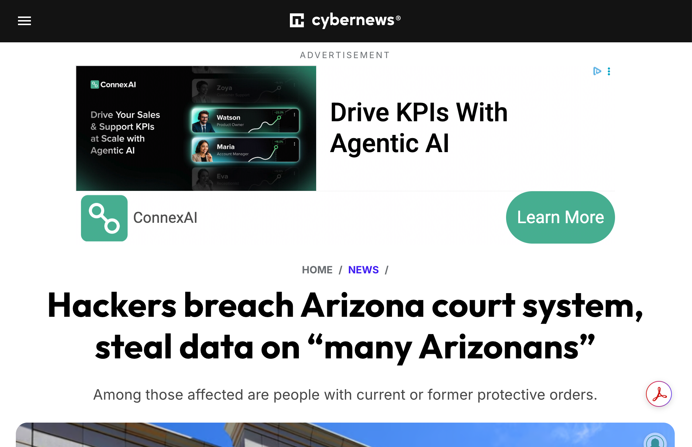
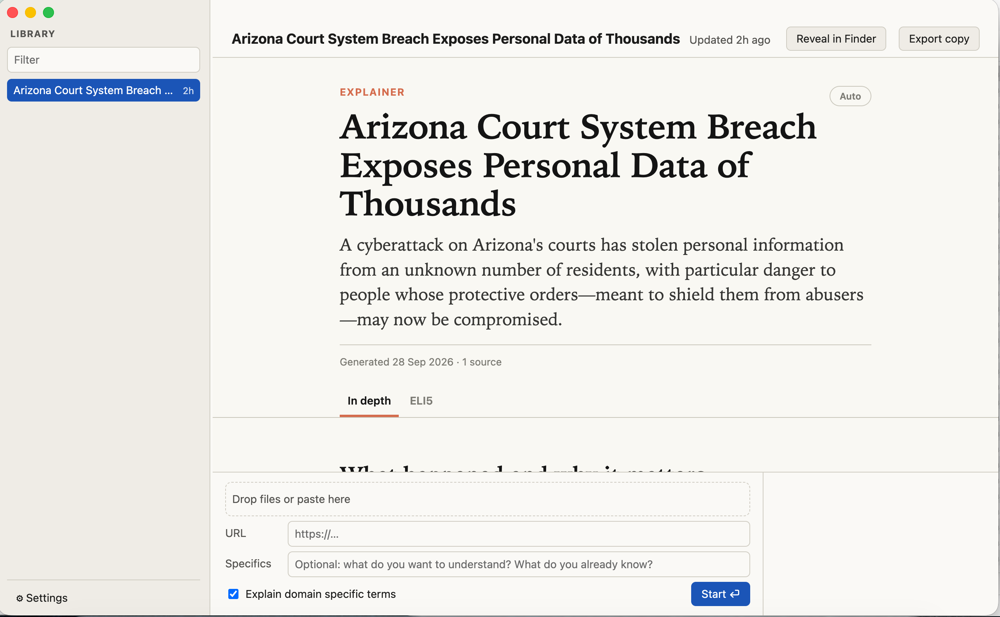
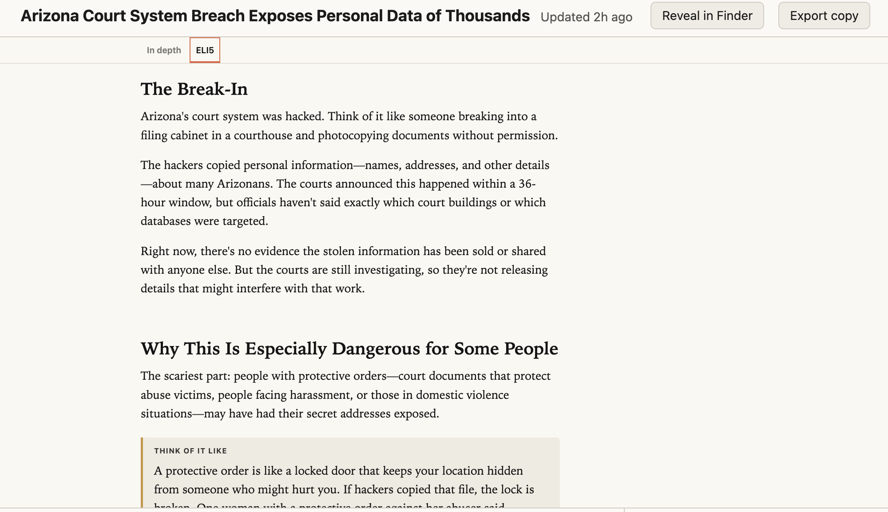
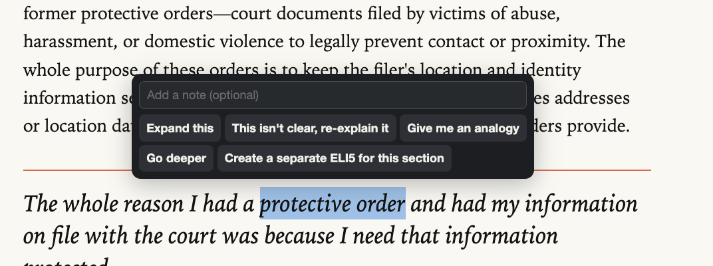
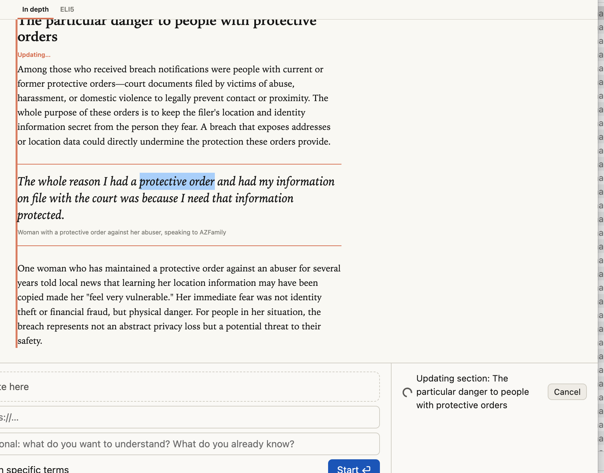
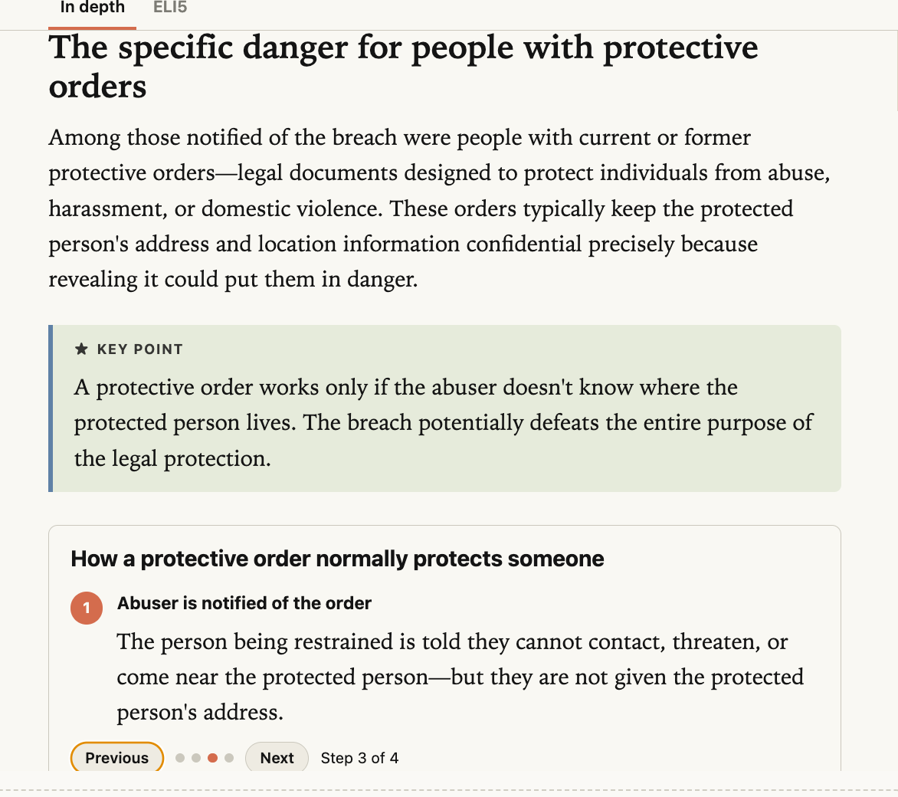
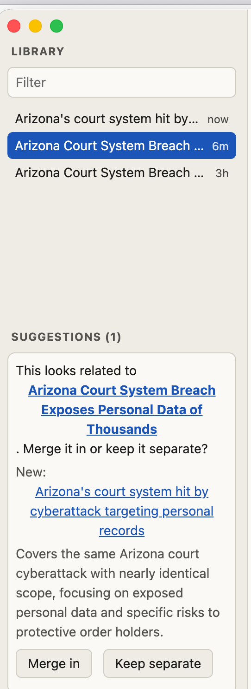
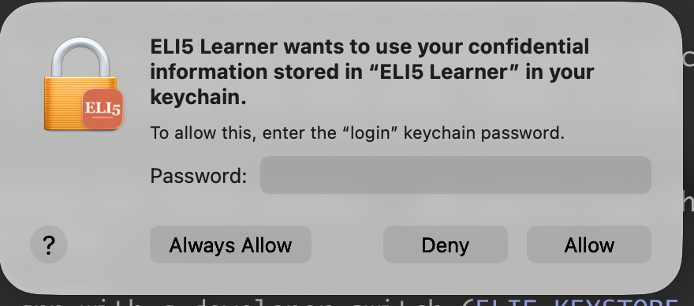

# ELI5 Learner

macOS app that turns decks, docs, PDFs, screenshots and URLs into interactive HTML explainers: an in-depth WSJ-style view plus an ELI5 view, refinable section by section.

> **Status:** v1 is feature-complete (milestones M0 to M4): generation, interactive reading, the library, local publishing, completion notifications, and test, CI and packaging hardening. Builds are unsigned.
> Full requirements: [spec/ELI5 Learner Product Requirements Document.md](spec/ELI5%20Learner%20Product%20Requirements%20Document.md)

## What it does

Drop in source material, optionally type a few clarifying specifics, hit Enter, and walk away. ELI5 Learner builds one self-contained `index.html` learning document with two views:

- **In depth.** Wall Street Journal-grade explanatory writing, with charts, diagrams, annotated figures, pull quotes and light interactivity. An optional in-context glossary explains jargon and acronyms in the right margin, next to where each one first appears.
- **ELI5.** The same material, rebuilt from scratch for comprehension, in plain words. It doesn't follow the structure of the source.

The document opens in the app's viewer and in any browser.

### From a web page to an explainer

Start from a link. This article on cybernews.com blocks automated downloads: a plain HTTP request,
such as `curl` or any scripted fetcher, gets **403 Forbidden**, even when it pretends to be a
browser.



ELI5 Learner still gets it. When a plain fetch is refused or comes back empty, the app loads the page
in a **hidden Chromium window**, the browser engine that already ships inside the Electron app. The page renders
exactly as it would in your browser, and the app reads the article from the rendered page. There's
no extra browser to install, and no login.

Paste the link, press Start, and a few minutes later the explainer is in your Library:



The ELI5 tab rebuilds the same material in plain words, with analogies and pictures:



## Features

- **Fire-and-forget generation.** No modals and no mid-job questions. A source that fails is skipped and listed in the document's references. Jobs can be queued.
- **Many inputs in one job.** Drag and drop, paste (Cmd+V) or URLs:
  - PowerPoint (slide order, bullet hierarchy and speaker notes are kept)
  - Word (headings, lists and tables are kept)
  - PDF, including scanned PDFs through vision
  - Markdown and text
  - Images and screenshots, sent straight to the model's vision input with no OCR step
  - Excel
  - Public web pages
- **Living documents.** Select any passage to get:
  - *Expand this*
  - *Re-explain it*
  - *Give me an analogy*
  - *Go deeper*
  - *Create a separate ELI5 for this section*

  Only that section is regenerated, in place.

  

  While it works, the section is marked "Updating…" and the status line shows the job, which you can cancel:

  

  When it's done, the section is rewritten in place and nothing else in the document changes. Here,
  *Expand this* on "protective order" rebuilt the section: a plain definition of the term, a key
  point explaining why the breach matters, and a step-by-step walkthrough of how a protective order
  normally protects someone:

  
- **Section ELI5 tabs.** Focused ELI5 tabs, spun off from any passage and labeled by topic. You can close them.
- **Library and menu bar.** Every document is listed in a sidebar. The menu bar shows the last three, and the app keeps running in the menu bar when the window is closed.
- **Merge suggestions.** When a new document covers the same or a related topic as one already in your
  Library, the app notices when the job finishes. It offers to merge the new material into the existing
  document to enrich it, instead of leaving two near-copies. The match doesn't have to be the same link:
  a different outlet's take on the story, or something a colleague sent that is sort of related, adds
  detail the first source didn't have. You can also do this on purpose to build one richer document from
  several sources.

  For example, after the cybernews article above, the same breach reported by FOX 10 Phoenix, with more
  on the personal records involved:

  

  When that job finishes, a suggestion waits quietly in the sidebar. It names the existing document and
  the new one and says why they match, and it never interrupts you. **Merge in** weaves the new material
  into the existing document: both the In depth and the ELI5 tab are revised in place, and new sections
  are added where they fit. Every enhancement is highlighted in its own color, a legend at the top says
  when and from what the document was enhanced (with a Hide highlights toggle), and the new sources are
  marked in the references. One Undo reverses the merge; **Keep separate** dismisses the suggestion.

  
- **Completion notifications.** A native macOS notification tells you when a document is ready. Clicking it opens the document in the app, or, if you choose, its published link in your browser.

## How it works

```
sources ──▶ resolve & extract ──▶ LLM generation ──▶ docs/<topic-slug>/index.html
 files        (file / clipboard /     (Claude or          + meta.json
 clipboard     public URL)             OpenAI)            + docs/catalog.json
 URLs                                                       │
                                                            ▼
                                                  merge-suggestion check
```

- **URL fetching:** first a plain HTTP fetch with Readability-style extraction. If that comes back empty, looks like a bot challenge, or is refused (403 or 429), the app renders the page in a hidden Electron window. There's no Puppeteer and no extra Chromium download.
- **Stable section IDs:** every section of every tab has a stable ID, so one section can be regenerated without touching the rest of the file.
- **Local storage:** documents live in the app's `docs/` folder. That folder is git-ignored because it's built from your own source material.

## Architecture: swappable seams

Every external capability sits behind an interface, so other backends can be swapped in without restructuring the app:

| Interface | Ships with | Documented stubs |
| --- | --- | --- |
| `LLMProvider` | Claude API, OpenAI API | AWS Bedrock |
| `SourceResolver` | Local files, clipboard, public URLs | MCP-brokered authenticated sources |
| `Publisher` | Local directory | Organization cloud drive, GitHub Pages |

The public build needs nothing but an API key: no accounts, no logins and no other services.

## Configuration

- LLM provider (Claude or OpenAI) and model name
- API key, stored in the macOS Keychain
- Default setting for "Explain domain-specific terms"
- Notifications: on or off, what a click opens (the document in the app, or its published link in your browser), a test button, and a shortcut to the macOS notification settings

## Not in v1

- Logins or authenticated sources
- Audio input or speech to text
- Cloud publishing (cloud drive, GitHub, Google Drive) and NotebookLM

## Roadmap

- Per-section version history with diff and rollback
- Google Drive publishing and NotebookLM linking

## Getting started

Requires macOS and Node.js 22.12 or newer.

```sh
npm install          # also downloads the Electron binary
npm run dev          # run the app with hot reload (development profile, separate from real data)
```

All milestones (M0 to M4 in [spec/tech/README.md](spec/tech/README.md)) are built: generation,
interactive reading, the library, local publishing, and the test, CI and packaging hardening.

| Command | What it does |
| --- | --- |
| `npm run build` | Production build of the public edition into `out/` |
| `npm run typecheck` / `npm run lint` | Strict TypeScript and ESLint, including module boundary rules |
| `npm test` | Unit, integration, renderer, eval-runner, perf and public contract tests (offline; network access fails the test) |
| `npm run test:e2e` | Test build, then Playwright: the app end to end, startup time, and the cross-browser suite |
| `npm run test:crossbrowser` | Golden documents in Chromium and WebKit (smoke, accessibility, zero network); no app build |
| `npm run check:spec` | Validates the spec's private-hook markers |
| `npm run check:hygiene -- --out out --package` | Public-repo hygiene over tracked files and a package build in `out/` |
| `npm run check:licenses` | Runtime dependency license allow list |
| `npm run check:editions` | Builds the edition cells (fixture overlay, missing overlay, public stubs) and checks them |
| `npm run package` | Unsigned `.dmg` via electron-builder (`npm run package:arm64` on Apple silicon) |
| `npm run test:package` | Checks the packaged app in `release/` (bundle contents, fuses, launch smoke) |

### Packaging (macOS)

The quickest way to build the app for your Mac:

```sh
scripts/build.sh            # installs dependencies if needed, then builds the unsigned .app and .dmg
scripts/build.sh --check    # run typecheck, lint and unit tests first
scripts/build.sh --clean --open   # clean build, then open the app
```

The same steps by hand:

```sh
npm run package:arm64      # clean build, then an unsigned arm64 dmg
npm run test:package       # optional: check the packaged app
```

The dmg lands in `release/` (for example `release/ELI5 Learner-0.1.0-arm64.dmg`). Build one dmg
per architecture on (or with `npm install --cpu=<arch>` for) that architecture; on an Intel Mac use
`CSC_IDENTITY_AUTO_DISCOVERY=false npx electron-builder --mac dmg --x64` after `npm run build`.
Signing and notarization run only when credentials are set (`CSC_LINK`/`CSC_KEY_PASSWORD`, and
`APPLE_API_KEY`/`APPLE_API_KEY_ID`/`APPLE_API_ISSUER` or
`APPLE_ID`/`APPLE_APP_SPECIFIC_PASSWORD`/`APPLE_TEAM_ID`). Without them the app is unsigned
(ad-hoc signed on Apple silicon).

**Opening an unsigned build.** macOS blocks apps that are not notarized. After the first launch
attempt, open System Settings > Privacy & Security and click **Open Anyway** next to the ELI5
Learner message. Or, after copying the app to Applications, run
`xattr -dr com.apple.quarantine "/Applications/ELI5 Learner.app"`.

### API key and the macOS Keychain

Add your Claude or OpenAI key in **Settings → AI**. The app stores it only in the macOS Keychain, as a
password item with service **"ELI5 Learner"** (account `llm.claude.apiKey` or `llm.openai.apiKey`).
It is never written to `settings.json` or the logs, and the Settings screen can save or clear it but
never read it back. You can see the item in the Keychain Access app by searching for "ELI5 Learner".

When the app first reads the key, macOS asks for permission:



Click **Always Allow**. Unsigned builds get a new code identity every time they are rebuilt, so macOS
asks again after each rebuild; a build signed with a stable identity (a Developer ID, see above)
asks only once. **Deny** is safe: the app then cannot use the key and asks you to add one in Settings.

### Generation-quality evals

`npm run eval -- --provider claude --model <id>` runs the rubric evals in `test/evals/` against a
real provider, scored by an LLM judge (see [test/evals/README.md](test/evals/README.md)). They cost
money and need the network, so they never run in `npm test`. Keys come only from
`ELI5_EVAL_API_KEY_CLAUDE` / `ELI5_EVAL_API_KEY_OPENAI`, and `ELI5_EVAL_MAX_USD` (default 10) caps
the spend. `npm run eval:calibrate` checks the judge against the hand-scored documents.

### Continuous integration

`.github/workflows/ci.yml` runs on every push to `main` and every pull request, on macOS runners:
static checks (types, lint, format, spec hooks, dependency audit and licenses), the Vitest projects
with coverage floors, a public build, the e2e and cross-browser suites, the edition cells, the
hygiene gate, and on `main` an unsigned dmg. The evals run nightly and on manual dispatch only; they
use the `ANTHROPIC_API_KEY` / `OPENAI_API_KEY` repository secrets and skip when those are unset. The
optional `ELI5_HYGIENE_DENYLIST` secret adds the term deny-list step to the hygiene gate.

In development, generated documents go to the gitignored `.library/` folder, never to `docs/`
(the public GitHub Pages source). Settings live in `~/Library/Application Support/ELI5 Learner (dev)/`.

## License

[MIT](LICENSE) © 2026 Omer Ansari
